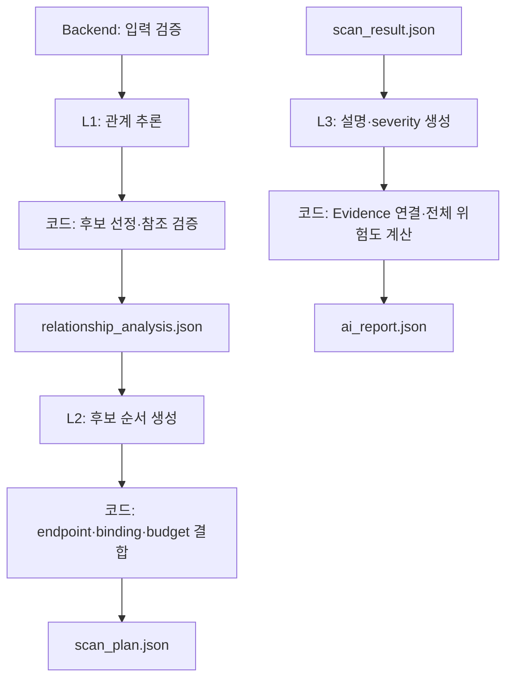

# LLM 기능 명세 수정본

## 1. 결론

고정 JSON의 필드 구조는 변경하지 않음. 기존 LLM 명세에서 고정 계약과 충돌하는
버전·입력 필드·모듈 매핑·심각도 책임만 수정함.

LLM 모듈이 최종 생산하는 Artifact는 다음 세 종류임.

| 단계 | 입력 | LLM 모듈 출력 |
| --- | --- | --- |
| L1 | `normalized_api_graph.json` v1.1, `target_profile.json` v1.1 | `relationship_analysis.json` v1.2 |
| L2 | 관계 분석, API 그래프, Target Profile, 현재 요청 사용량 | `scan_plan.json` v1.2 |
| L3 | `scan_result.json` v1.2 | `ai_report.json` v1.2 |

백엔드가 호출하는 LLM 내부 Job API와 결과 callback client는 구현 범위임.
백엔드의 DB·Artifact 저장과 프론트엔드 DTO는 LLM 구현 범위가 아님. Executor의
HTTP 요청, Evidence 수집, 규칙 판정도 LLM 구현 범위가 아님.

### 1.1 로그인 정보 전달 책임

현재 MVP에서 프론트엔드는 검사 URL과 사전에 등록된 Target Profile 식별자만
백엔드에 전달함. 사용자명·비밀번호·토큰을 프론트엔드 요청이나 JSON Artifact에
포함하지 않음.

백엔드는 서버 설정을 이용해 `target_profile.json`을 만들며, 실제 자격증명 대신
`username_env`, `password_env` 환경변수 이름만 기록함. 해당 환경변수의 실제 값은
Scanner Worker의 실행 환경 또는 Secret Manager에 있어야 함.

스캐너는 Target Profile의 환경변수 참조를 런타임에 해석해 User A/B로 로그인하고
토큰·세션을 메모리에서만 관리함. 백엔드가 스캐너에 전달하는 것은 로그인 요청
형식과 자격증명 참조이며 실제 로그인 값이 아님.

```text
Frontend: target_url, target_profile_id
    → Backend: target_profile.json 생성
    → Scanner: 환경변수 참조 해석, A/B 로그인
    → LLM: 자격증명·토큰·객체 ID를 제외한 계약 JSON만 사용
```

향후 사용자가 직접 계정을 입력하는 기능을 추가하더라도 프론트엔드는 TLS로
백엔드에 일회성 제출하고, 백엔드는 단기 Secret 참조로 변환해야 함. 실제 값을
Target Profile, DB 일반 컬럼, 로그 또는 LLM 입력에 넣지 않음.

## 2. 기존 명세의 필수 수정 사항

| 기존 내용 | 문제 | 수정 |
| --- | --- | --- |
| Target Profile·API Graph v1.2, Scan Result v1.3 | 고정 계약과 버전 불일치 | 각각 v1.1, v1.1, v1.2 사용 |
| `requests_used`, `security`, `verdict`, 입력 `severity` 필수 | 해당 필드가 고정 입력 JSON에 없음 | 필수 입력에서 제거 |
| `AUTHN-001`을 `authz`에서 생성 | 현재 승인 목록에 인증 모듈 매핑이 없음 | `authz → BOLA-001`만 적용 |
| Verifier가 severity를 확정한다고 기재 | `scan_result.json`에는 severity가 없음 | L3가 `ai_report.findings[].severity` 생성 |
| L3가 verified finding만 필터링 | `scan_result.findings[]`에는 verdict가 없음 | 배열에 들어온 모든 Finding을 확정 Finding으로 취급 |
| LLM을 import 전용 라이브러리로 구현 | 백엔드의 비동기 Job·callback 구조와 연동 불가 | 생성 서비스 위에 내부 FastAPI Job wrapper와 callback client 제공 |
| L2가 `requests_already_used`를 JSON에서 읽음 | 어느 Artifact에도 현재 사용량이 없음 | 백엔드 Job 메타데이터로 별도 전달 |
| 인증 메타데이터로 `auth_dependency` 생성 | API Graph v1.1에 인증 메타데이터가 없음 | 현재 버전에서는 생성 금지 |
| 민감도 분류 출력으로 DATA 후보 생성 | API Graph outputs에 `data_class`가 없음 | 출력이 있는 허용 GET을 DATA 후보로 두고 Executor 규칙이 실제 노출 판정 |
| 동일 입력을 최대 2회 그대로 재시도 | `temperature=0`에서 같은 오류가 반복될 가능성 | 참조·스키마 검증 피드백을 추가해 재요청 |

## 3. 전체 흐름



모델이 생성할 필요가 없는 ID, endpoint, Evidence 참조, 예산 계산과 전체 위험도는
코드가 처리함. 모델은 관계·실행 순서·보고서 문장에만 사용함.

## 4. 구현 대상

| 파일 | 책임 |
| --- | --- |
| `llm/contracts.py` | 고정 JSON 및 내부 Structured Output Pydantic 모델 |
| `llm/prompts.py` | L1·L2·L3 프롬프트 정본과 SHA-256 |
| `llm/service.py` | 세 단계 실행, 후보 선정, 참조 검증, 재시도와 결과 조립 |
| `llm/errors.py` | 백엔드가 변환할 공통 LLM 오류 |
| `llm/api.py` | 비동기 Job 접수, 202 응답, 멱등 처리와 Background 실행 |
| `llm/integration/backend_client.py` | 고정 Backend URL, 내부 인증과 성공·실패 callback |
| `tests/test_service.py` | 계약·참조·AUTHN 제외·예산·Evidence·빈 결과 테스트 |

DB 모델, 메시지 큐 SDK, 에이전트 프레임워크와 PDF 생성기는 추가하지 않음.

## 5. L1 관계 분석

### 입력

- `normalized_api_graph.json` v1.1
- Target Profile은 모델에 보내지 않고 코드의 범위·승인 모듈 검사에만 사용함.

### 모델 출력

모델은 외부 계약이 아닌 내부 `RelationshipDraft`를 생성함.

- 입력에 존재하는 Operation 간 `id_flow`, `ownership`, `call_order`, `data_flow`
- source output과 target input의 정확한 참조
- 0.5 이상 confidence

`auth_dependency`는 입력 그래프 v1.1만으로 근거를 확인할 수 없어 생성하지 않음.

### 코드 처리

1. Operation·output field·input parameter 참조를 원본 그래프와 대조함.
2. 중복 관계를 제거하고 `rel-001` 형식의 ID를 순서대로 부여함.
3. Target Profile 승인 범주를 다음과 같이 매핑함.

| 승인 범주 | Module ID |
| --- | --- |
| `authz` | `BOLA-001` |
| `input_validation` | `INPUT-001` |
| `data_exposure` | `DATA-001` |

`AUTHN-001`은 고정 JSON 예시에 등장하지만 현재 승인 범주와 매핑되지 않으므로
`approved_module_ids`와 `test_candidates`에 넣지 않음.

4. 규칙 기반으로 후보와 binding hint를 생성함.

| Module | 후보 조건 |
| --- | --- |
| `BOLA-001` | 허용 GET, `id_flow` 또는 `ownership`, `*_id` target 입력 |
| `INPUT-001` | 허용 GET의 path/query 입력 존재 |
| `DATA-001` | 허용 GET의 output 존재 |

## 6. L2 스캔 계획

### 모델 입력·출력

모델은 검증된 `relationships`와 `executable=true` 후보만 받음. 내부
`PlanDraft.ordered_candidate_ids`에 모든 후보 ID를 각각 한 번씩 반환함.

### 코드 처리

- `module_id`, `target_operation_id`, `target_endpoint`를 원본 후보와 그래프에서 복사함.
- `object_binding` owner는 BOLA이면 `user_b`, 그 밖에는 `user_a`로 설정함.
- `parameter_binding`의 `object_type`, `owner`는 `null`로 설정함.
- `plan_id`는 scan ID와 후보 순서로 UUIDv5 생성함.
- 상태는 항상 `PENDING_APPROVAL`로 생성함. LLM이 승인 상태를 변경하지 않음.

요청 사용량은 새 JSON Artifact를 만들지 않고 다음 메서드 인자로 받음.

```python
create_scan_plan(
    target_profile,
    normalized_api_graph,
    relationship_analysis,
    requests_already_used=12,
)
```

현재 실행 요청 추정치는 Executor 모듈 정의와 공유해야 함.

| Module | 단계당 추정 요청 |
| --- | ---: |
| `BOLA-001` | 2 |
| `INPUT-001` | 2 |
| `DATA-001` | 1 |

```text
within_budget =
  requests_already_used + estimated_execution_requests <= max_requests
```

예산을 초과해도 계산 결과가 포함된 `PENDING_APPROVAL` 계획을 생성함. 최종 실행
승인·거부는 백엔드 정책 검증과 Executor가 담당함.

후보가 0개이면 모델을 호출하지 않고 `steps: []`,
`estimated_execution_requests: 0`인 정상 계획을 생성함.

## 7. L3 AI 보고서

`scan_result.findings[]`에 들어온 항목은 Verifier가 확정한 Finding으로 취급함.
입력에 없는 `verdict`를 요구하거나 필터링하지 않음.

### 모델 생성

- `finding_id`
- `root_cause`
- `attack_flow`
- `impact`
- `recommendation`
- `severity`

### 코드 생성·복사

- `analysis_id`: scan ID와 finding ID로 UUIDv5 생성
- `evidence_refs`: 원본 Finding에서 그대로 복사
- `overall_risk`: Finding severity의 최댓값
- `overall_risk_basis`: `rule:max_verified_severity`
- `summary`: Finding 수와 최대 severity로 생성

모델이 Finding을 추가·누락·중복하거나 Evidence 참조를 생성하지 못하도록 원본 ID
집합을 대조함.

## 8. 빈 Finding 처리 규칙

고정 `ai_report.json`에는 “확정 Finding 없음”을 표현하는 별도 risk enum과 basis가
없음. 계약을 바꾸지 않는 조건에서 다음 규칙을 사용함.

```json
{
  "overall_risk": "low",
  "overall_risk_basis": "rule:max_verified_severity",
  "summary": "검증 규칙으로 확정된 취약점이 없습니다.",
  "findings": []
}
```

백엔드와 프론트엔드는 `overall_risk=low`만 보고 “안전”으로 표시하면 안 됨.
`findings=[]`를 함께 확인해 “확정된 취약점 없음”으로 표시해야 함.

장기적으로 계약 변경이 허용되면 `overall_risk: "none"` 또는
`overall_risk_basis: "rule:no_verified_findings"` 추가가 더 정확함.

## 9. 프롬프트와 재현성

프롬프트 정본은 `llm/prompts.py`임. 현재 코드의 실제 UTF-8 바이트 기준 해시는
다음과 같음.

| 단계 | 버전 | SHA-256 |
| --- | --- | --- |
| L1 | `rel-v2` | `bb384bf9f591b7eaae06a279a1001b8097f273ac036fbeb013f36419b700d762` |
| L2 | `plan-v2` | `45fe2c585d762d9af7829622484224bbd24aecb802507ea1d86b2aced323a1e1` |
| L3 | `report-v2` | `181ad411cd192cfd9e3831abc57f15ae2044f32a78dacf7bf705c095fb49bc94` |

기존 명세의 해시는 수정 전 프롬프트 값이므로 새 프롬프트 본문과 함께 사용할 수
없음. `prompt_sha256` 필드 구조는 유지하고 값만 실제 프롬프트에서 계산함.

모델 기본값은 계약 예시와 같은 `gpt-4o-mini-2024-07-18`, temperature는 0,
추가 재시도는 최대 2회임.

## 10. 오류 처리

| 오류 | 재시도 |
| --- | --- |
| 단계별 timeout | 최대 2회 |
| Rate Limit·5xx | 최대 2회 |
| Structured Output 불일치 | 검증 피드백과 함께 최대 2회 |
| 입력에 없는 참조 | 참조 재대조 지시와 함께 최대 2회 |
| 잘못된 입력 JSON·scan ID 불일치 | 재시도 없음 |
| 인증·권한·잘못된 API 요청 | 재시도 없음 |
| 승인되지 않은 Module | 재시도 없음 |

모든 입력·출력 모델은 `extra="forbid"`를 사용함.

## 11. 백엔드 연결 규칙

백엔드는 다음 내부 Job API를 호출함. 모든 요청은 백엔드가 만든 `job_id`를
포함하며 LLM 서비스는 HTTP 202를 반환한 뒤 Background Task에서 실행함.

| Job API | 실행 메서드 | 성공 callback |
| --- | --- | --- |
| `POST /jobs/relationship-analysis` | `analyze_relationships(...)` | `POST /internal/scans/{scan_id}/relationship-analysis` |
| `POST /jobs/scan-plan` | `create_scan_plan(...)` | `POST /internal/scans/{scan_id}/scan-plan` |
| `POST /jobs/ai-report` | `create_ai_report(...)` | `POST /internal/scans/{scan_id}/ai-report` |

성공 callback 본문은 각 Pydantic 결과의 `model_dump(mode="json")`이며 JSON
Artifact 필드를 추가하지 않음. 실패 callback은
`POST /internal/scans/{scan_id}/failed`로 보내며 `source=LLM`, 해당 백엔드
ScanStage와 단계별 고정 오류 코드·메시지만 포함함.

동일 `job_id`는 프로세스 수명 동안 한 번만 실행함. callback URL은 Job 본문에서
받지 않고 `BACKEND_BASE_URL` 설정으로 고정하여 SSRF 경계를 닫음.
`INTERNAL_AUTH_ENABLED=true`이면
`Authorization: Bearer <INTERNAL_SERVICE_TOKEN>`을 callback에 포함함.

스캐너가 LLM이나 프론트엔드에 원본 Artifact를 직접 제공한다고 구현하지 않음.
실제 전송 경로와 접근 제어는 백엔드가 소유함.

## 12. 완료 조건

- 여섯 고정 JSON의 필드 구조를 변경하지 않음.
- 입력 v1.1, 출력 v1.2 버전을 정확히 검사함.
- 현재 미승인 `AUTHN-001`을 생성하지 않음.
- 모든 operation·field·parameter·candidate·finding 참조를 원본과 대조함.
- 실제 계정값·토큰·객체 ID·원시 응답을 모델 입력으로 받지 않음.
- 모델이 Evidence 참조, endpoint, budget, UUID와 승인 상태를 만들지 않음.
- 빈 Finding을 정상 결과로 처리함.
- 세 Job endpoint가 202를 반환하고 동일 `job_id`를 중복 실행하지 않음.
- 생성 결과와 실패를 고정 Backend callback 경로와 인증으로 전달함.
- OpenAI 호출 없는 생성 테스트와 `httpx.MockTransport` callback 통합 테스트를
  구분함.

## 참고

- [OpenAI Structured Outputs](https://developers.openai.com/api/docs/guides/structured-outputs)
- [OpenAI Responses API text generation](https://developers.openai.com/api/docs/guides/text?api-mode=responses)
- [Ponytail 최소 구현 원칙](https://github.com/DietrichGebert/ponytail/blob/main/AGENTS.md)
