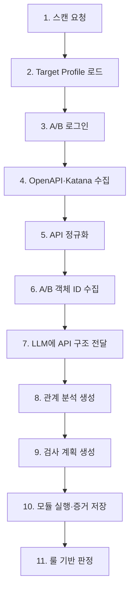

# 스캐너 명세서

API Vulnerability Scanner 명세

## 1. 목적

vuln-bank의 API를 수집·분석하고, user_a/user_b 세션을 이용해 BOLA, 인증, 거래 검증, 민감정보 노출을 증거 기반으로 판정한다.

## 2. 전체 흐름



| 단계 | 기능 | 산출물 |
| --- | --- | --- |
| 1 | 백엔드가 스캔 작업을 생성한다. | `scan_id` |
| 2 | 대상 URL, 범위, 로그인 설정, 제한 정책을 읽는다. | `target_profile.json` |
| 3 | user_a/user_b 로그인 후 토큰·세션을 확보한다. | Runtime Session Context |
| 4 | OpenAPI 우선, Katana 보완 방식으로 API 후보를 수집한다. | OpenAPI·Katana 결과 |
| 5 | Method, path, 입력값, 인증, 응답 필드를 공통 구조로 변환한다. | `normalized_api_graph.json` |
| 6 | 정규화된 API를 호출해 A/B의 계좌·거래·카드 ID를 수집한다. | Runtime Object Context |
| 7 | `normalized_api_graph.json`과 사용 가능한 객체 유형 정보를 LLM에 전달한다. 실제 토큰·ID는 전달하지 않는다. | LLM 분석 입력 |
| 8 | LLM이 API 관계와 검사 후보를 분석한다. | `relationship_analysis.json` |
| 9 | LLM이 모듈, 대상 API, 입력 바인딩, 실행 순서를 제안한다. | `scan_plan.json` |
| 10 | Executor가 범위·요청 제한을 확인한 후 기준·변형 요청을 실행한다. | `execution_evidence.json` |
| 11 | Verifier가 증거에 룰을 적용해 결과를 확정한다. | `scan_result.json` |

## 3. 스캐너 구조

```
scanner/
├─ crawler/
│  ├─ katana_runner.py      # OpenAPI 보완 수집
│  └─ normalizer.py         # 수집 결과 정규화
├─ auth/
│  └─ session_manager.py    # A/B 로그인, 토큰·객체 ID 관리
├─ modules/
│  ├─ bola.py               # A 토큰 + B 객체 ID 검사
│  ├─ auth.py               # 토큰 제거·무효 토큰 검사
│  ├─ transaction.py        # 비정상 거래 입력과 상태 변화 검사
│  └─ data_exposure.py      # 응답 민감정보 검사
├─ executor.py              # HTTP 실행, 요청·응답·상태 기록
├─ verifier.py              # evidence 룰 판정
└─ scanner.py               # 전체 흐름 제어
```

## 4. 모듈별 판정 기준

| 모듈 | 기준 요청 | 변형 요청 | `verified` 조건 |
| --- | --- | --- | --- |
| BOLA | A 토큰 + A 객체 ID | A 토큰 + B 객체 ID | B 소유 객체가 반환되거나 변경됨 |
| Auth | 유효 토큰 요청 | 토큰 없음 또는 무효 토큰 | 보호 자원 접근 또는 상태 변경 성공 |
| Transaction | 정상 상태 조회 | 음수·0·한도 초과 거래 | 비정상 입력 후 잔액·거래 상태 변경 |
| Data Exposure | 성공 응답 검사 | 없음 | 금지된 민감 필드·값이 마스킹 없이 반환됨 |

증거가 부족하면 `inconclusive`로 종료한다. LLM은 취약점을 확정하지 않는다.

## 5. API

| API | 요청/응답 | 목적 |
| --- | --- | --- |
| `POST /api/scans` | `target_profile_id`, `requested_modules` → `scan_id` | 스캔 시작 |
| `GET /api/scans/{scan_id}` | 상태·진행률 | 스캔 상태 조회 |
| `GET /api/scans/{scan_id}/findings` | `scan_result.json` | 확정 결과 조회 |

프론트엔드는 계정 정보나 토큰을 전송하지 않고 `target_profile_id`만 보낸다.

## 6. JSON 계약

| 파일 | 생산 → 소비 | 핵심 내용 |
| --- | --- | --- |
| `target_profile.json` | 백엔드 설정 → 스캐너 | 대상 범위, A/B 계정 환경변수 참조, 요청 제한 |
| `normalized_api_graph.json` | 스캐너 → LLM·스캐너 | 정규화된 API, 파라미터, 응답 필드, API 간 연결 |
| `relationship_analysis.json` | LLM → 스캐너 | 객체·데이터 흐름, 검사 후보 |
| `scan_plan.json` | LLM → Executor | 모듈, 대상 API, 입력 바인딩, 실행 순서 |
| `execution_evidence.json` | Executor → Verifier | 기준·변형 요청, 응답, 상태 전후 비교 |
| `scan_result.json` | Verifier → 백엔드·LLM·프론트 | `verified` finding 또는 `inconclusive` 결과 |

## 7. 필수 원칙

- 실제 계정값·토큰·객체 ID는 JSON 계약이나 LLM에 전달하지 않는다.
- Executor는 허용된 도메인·메서드·모듈·요청 횟수 안에서만 실행한다.
- `execution_evidence.json`은 판정 결과가 아니라 증거다.
- `scan_result.json`의 최종 판정은 Verifier의 룰이 만든다.