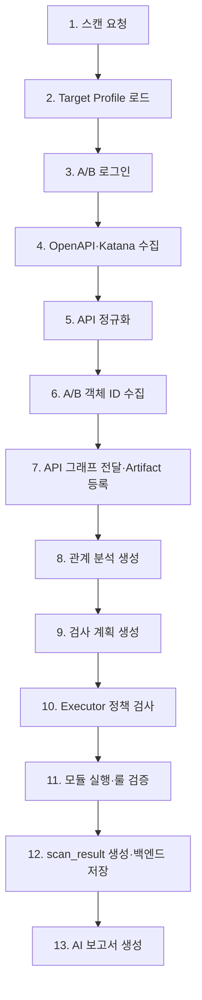

# 스캐너

## 1. 목적

🔄 변경됨 (백엔드·JSON 계약 기준): `vuln-bank`의 API 구조를 수집·정규화하고, `target_profile.json.safety_policy.approved_modules`에 있는 `authz`, `input_validation`, `data_exposure` 범위만 능동 검사한다. `AUTHN-001`은 `relationship_analysis.json` 예시에는 있지만 현재 Target Profile의 승인 목록에는 없으므로 실행 대상이 아니며, 거래 모듈도 현재 JSON 계약에는 포함되지 않는다.

- 모듈 실행기와 검증기는 하나의 Executor 책임으로 통합한다.
- LLM은 API 관계 분석, 검사 계획 생성, 최종 보고서 작성만 수행한다.
- 취약점의 확정은 LLM이 아니라 Executor 내부 Verifier 역할의 고정 룰이 수행한다.
- 백엔드는 `scan_id`, Scanner Job 상태, Artifact 저장·검증, 프론트엔드용 API를 담당한다. 스캐너는 공개 REST API를 제공하지 않고 백엔드의 내부 작업 요청과 취소 요청만 처리한다.

## 2. 전체 흐름 🔄 변경됨



| 단계 | 기능 | 산출물 |
| --- | --- | --- |
| 1 | 백엔드가 프론트엔드 요청을 받아 스캔 작업을 생성한다. | `scan_id` |
| 2 | 🔄 변경됨: 백엔드가 전달한 `target_profile.json` 또는 Artifact 참조를 로드하고 `scan_id`, 스키마 버전, 대상 범위, 로그인 설정과 안전 정책을 검증한다. | `target_profile.json` v1.1 |
| 3 | `user_a`·`user_b`로 로그인해 토큰 또는 세션을 런타임에만 확보한다. | Runtime Session Context |
| 4 | OpenAPI를 우선 사용하고, A/B 인증 세션을 주입한 Katana로 누락 API 후보를 보완 수집한다. | OpenAPI·Katana 결과 |
| 5 | 🔄 변경됨: HTTP 메서드, 경로, 입력 구조와 응답 구조를 JSON 계약의 `operations[]` 형식으로 변환하고 `scan_id`를 유지한다. | `normalized_api_graph.json` v1.1 |
| 6 | 정규화된 API를 호출해 A/B의 계좌·거래·카드 등 검사에 필요한 객체 ID를 런타임에 수집한다. | Runtime Object Context |
| 7 | 🔄 변경됨: JSON 계약에 따라 `normalized_api_graph.json` v1.1을 LLM에 전달한다. 동시에 백엔드에는 Artifact 참조·스키마 버전·체크섬과 수집 통계를 등록한다. 실제 토큰·객체 ID·응답값과 별도의 Runtime Context JSON은 전달하지 않는다. | `normalized_api_graph.json` v1.1 + Artifact 메타데이터 |
| 8 | 🔄 변경됨: LLM이 API 간 관계와 검사 후보를 분석한다. 스캐너는 백엔드와 함께 결과를 소비하되 `scan_id`, Operation 참조와 Module ID를 검증한 뒤 런타임 객체와 결합한다. | `relationship_analysis.json` v1.2 |
| 9 | 🔄 변경됨: LLM이 `PENDING_APPROVAL` 상태의 선언형 검사 계획을 생성해 Executor에 전달한다. 백엔드는 Artifact 참조와 Job 상태를 추적하며, JSON 계약에 승인 상태 전환 주체가 정의되어 있지 않으므로 스캐너가 임의로 상태를 변경하거나 백엔드가 전환한다고 단정하지 않는다. | `scan_plan.json` v1.2 |
| 10 | 🔄 변경됨: Executor가 `scan_plan.json`과 `target_profile.json`의 범위·메서드·승인 모듈·요청 예산을 확인해 실행 가능 단계를 결정한다. | 정책 검증 결과 |
| 11 | Executor가 기준·변형 요청을 실행하고 수집한 증거에 고정 룰을 적용한다. 원시 증거는 민감값을 마스킹한 내부 artifact로 보관한다. | 내부 Evidence Artifact |
| 12 | 🔄 변경됨: Executor 내부의 Verifier 역할이 확정 Finding과 Evidence 참조를 `scan_result.json` v1.2로 생성한다. 백엔드는 원본을 검증·저장하고 LLM 보고서 입력과 프론트엔드용 가공 DTO를 제공한다. 스캐너는 프론트엔드에 원본 파일을 직접 제공하지 않으며 `severity`도 이 파일에 넣지 않는다. | `scan_result.json` v1.2 + Evidence Artifact 참조 |
| 13 | 🔄 변경됨: LLM이 `scan_result.json`의 확정 Finding을 설명하고 영향·대응방안·심각도를 작성한다. 백엔드는 Scanner Job 완료와 보고서 생성 완료를 별도 상태로 추적한다. | `ai_report.json` v1.2 |

## 3. 스캐너 구조 🔄 변경됨

```
scanner/
├─ crawler/
│  ├─ katana_runner.py      # 인증 세션을 주입한 Katana 보완 수집
│  └─ normalizer.py         # 수집 결과를 API 구조로 정규화
├─ auth/
│  └─ session_manager.py    # A/B 로그인, 토큰·객체 ID의 런타임 관리
├─ modules/
│  ├─ bola.py               # policy authz → plan module BOLA-001
│  ├─ auth.py               # plan module AUTHN-001, 현재 Target Profile에서는 비활성
│  ├─ input_validation.py   # policy input_validation → plan module INPUT-001
│  └─ data_exposure.py      # policy data_exposure → plan module DATA-001
├─ integration/
│  └─ backend_client.py     # Job 상태·진행률, Artifact 메타데이터, 오류·취소 연동
├─ executor.py              # 정책 확인, HTTP 실행, 증거 수집, 룰 검증, scan_result 생성
└─ scanner.py               # 전체 흐름 제어
```

`verifier.py`와 `execution_evidence.json`은 별도 구성요소로 두지 않는다. `executor.py`가 모듈 실행 직후 해당 모듈의 고정 룰을 적용하고, 최종 결과만 `scan_result.json`으로 만든다.

🔄 변경됨: JSON 계약은 정책 승인값과 실행 계획의 Module ID를 구분한다. `approved_modules`는 `authz`, `input_validation`, `data_exposure`이고, 대응하는 `scan_plan.steps[].module_id`는 각각 `BOLA-001`, `INPUT-001`, `DATA-001`이다. `AUTHN-001`은 현재 승인 목록에 매핑되지 않으므로 실행하지 않는다.

원시 요청·응답과 상태 비교 자료는 JSON 계약에 직접 넣지 않는다. 민감값을 마스킹한 Evidence Artifact에 보관하고, 확정 Finding에서 `evidence_refs`로만 연결한다.

## 4. 모듈별 판정 기준 🔄 변경됨

| `approved_modules` 값 | `scan_plan` Module ID | 검사 | `verified` 조건 |
| --- | --- | --- | --- |
| `authz` | `BOLA-001` | A 토큰 + A 객체와 A 토큰 + B 객체 비교 | B 소유 객체가 반환되거나 접근이 허용됨 |
| `input_validation` | `INPUT-001` | 정상 입력과 비상태변경 경계·형식 오류 입력 비교 | 잘못된 입력 수용과 함께 규칙에 정의된 보안 영향이 관찰됨 |
| `data_exposure` | `DATA-001` | 성공 응답의 출력 필드 검사 | 금지된 민감 필드·값이 마스킹 없이 반환됨 |
| 현재 매핑 없음 | `AUTHN-001` | 계약 예시에는 존재 | 현재 `target_profile.json` 승인 목록에 없으므로 실행하지 않음 |

🔄 변경됨: 단순히 HTTP 2xx가 반환되거나 잘못된 입력이 허용됐다는 이유만으로 Finding을 확정하지 않는다. 각 Rule ID가 요구하는 보안 영향 조건이 함께 충족되어야 한다.

| 테스트 결과 | 처리 |
| --- | --- |
| `verified` | 🔄 변경됨: `scan_result.json.findings[]`에 추가한다. `severity`는 `ai_report.json`에서 생성한다. |
| `not_found` | Finding으로 저장하지 않고 작업 상태·감사 로그에서 관리 |
| `inconclusive` | 증거 부족 또는 실행 불가 사유를 작업 상태·감사 로그에서 관리 |

`scan_result.json`의 빈 `findings` 배열은 **확정된 취약점이 없었다**는 뜻일 뿐, 모든 API가 안전하다는 의미는 아니다.

## 5. JSON 연동 계약 🔄 변경됨

스캐너의 입출력은 JSON 계약의 생산자·소비자 관계를 그대로 따른다. 🔄 변경됨: 이 표는 JSON의 논리적 생산자·소비자를 뜻하며 공개 REST API의 소유권이나 원본 파일의 직접 노출을 뜻하지 않는다. 공개 DTO와 프론트엔드 전달 경로는 백엔드 명세를 따른다.

| 생산 → 소비 | 계약 | 스캐너 책임 |
| --- | --- | --- |
| 백엔드 → 스캐너 | 🔄 변경됨: `target_profile.json` v1.1 | 대상·인증·안전 정책을 적용 |
| 스캐너 → LLM | 🔄 변경됨: `normalized_api_graph.json` v1.1 | API 구조를 생성해 LLM에 전달하고 백엔드에 Artifact 메타데이터를 등록 |
| LLM → 백엔드·스캐너 | 🔄 변경됨: `relationship_analysis.json` v1.2 | 관계·후보와 참조 무결성을 확인해 런타임 객체와 결합 |
| LLM → Executor | 🔄 변경됨: `scan_plan.json` v1.2 | 상태를 임의로 변경하지 않고 허용 범위·예산·Module ID를 다시 검사 |
| Verifier 역할 → 백엔드·LLM·프론트 | 🔄 변경됨: `scan_result.json` v1.2 | 검증 완료 Finding만 생성. 원본 저장·LLM 연결·프론트 DTO 제공은 백엔드가 담당 |
| LLM → 백엔드·프론트 | 🔄 변경됨: `ai_report.json` v1.2 | 스캐너는 소비·수정하지 않음 |

🔄 변경됨: 실제 전송은 다음과 같이 처리한다. 백엔드는 Scanner Job을 생성하고 `target_profile.json` 또는 참조를 전달한다. 스캐너는 `normalized_api_graph.json`을 LLM에 전달하면서 백엔드에 Artifact 참조와 진행 상태를 등록한다. `scan_result.json`은 백엔드가 검증·저장한 뒤 LLM 보고서 입력과 프론트엔드용 DTO로 연결한다. 따라서 스캐너는 프론트엔드용 공개 엔드포인트를 두지 않는다.

`runtime_scan_context.json`과 `execution_evidence.json`은 JSON 계약에 없으므로 외부 계약 파일로 생성하지 않는다. 세션·객체 ID·원시 Evidence는 스캐너 런타임과 마스킹된 내부 Artifact로만 관리하고 `scan_result.json.evidence_refs`로 연결한다.

### `normalized_api_graph.json` 범위

이 파일은 API 구조만 담는다.

- 포함: `operation_id`, `method`, `path_template`, `inputs`, `outputs`
- 제외: API 간 `edges`, `confidence`, 인증 방식, 실제 요청·응답값, 토큰, 객체 ID, 수집 출처, 민감도 판단

API 간 관계와 검사 우선순위는 이후 `relationship_analysis.json`의 책임이다.

### `target_profile.json` 정책 해석

- `allowed_methods`는 **능동 검사 요청**에 적용한다.
- 인증 준비를 위한 `authentication.login` 요청은 별도 예외로 처리한다.
- 상태 변경 요청은 `state_change_policy`가 허용할 때만 수행한다.
- 🔄 변경됨: `approved_modules` 허용값은 JSON 계약 그대로 `authz`, `input_validation`, `data_exposure`이다. 계획의 Module ID는 각각 `BOLA-001`, `INPUT-001`, `DATA-001`로 매핑한다.

## 6. 필수 원칙 🔄 변경됨

- 실제 계정값·비밀번호·토큰·객체 ID·원시 응답값은 JSON 계약, 백엔드 일반 DB 컬럼, 로그와 LLM 입력에 넣지 않는다.
- 모든 생성 Artifact는 입력의 `scan_id`를 유지하고 계약의 `schema_version`을 사용한다. 백엔드에는 Artifact 유형·참조·크기·SHA-256 체크섬을 등록한다.
- 인증·API 수집·정규화·모듈 실행·룰 판정 단계의 진행률과 통계를 Scanner Job ID와 함께 백엔드에 보고한다.
- 백엔드 내부 요청과 콜백에는 서비스 토큰 또는 요청 서명을 사용하며, 공통 오류 코드와 재시도 가능 여부를 전달한다.
- 백엔드가 취소를 요청하면 새 HTTP 요청을 중단하고 안전한 지점에서 Job을 종료한 뒤 실제 종료 상태를 보고한다.
- Executor는 모든 요청 전에 허용 도메인·경로·메서드·승인 모듈·초당 요청 수·상태 변경 정책을 확인하고, `scan_plan.json.budget`의 `requests_already_used`, `estimated_execution_requests`, `max_requests`, `within_budget`을 기준으로 예산을 검사한다. JSON 계약의 하단 계산식에는 `requests_used`라고 적혀 있지만 새 별칭을 만들지 않고 실제 필드명인 `requests_already_used`를 사용한다.
- 🔄 변경됨: `scan_plan.json.status`의 예시는 `PENDING_APPROVAL`이다. 승인 상태를 바꾸는 주체는 현재 JSON 계약에 없으므로 스캐너 문서에서 백엔드라고 단정하지 않는다. Executor는 상태를 임의로 변경하지 않으며, `PENDING_APPROVAL`인 계획은 실행하지 않고 승인 주체와 실행 가능 상태가 확정될 때까지 Job을 대기 처리한다.
- `scan_result.json`에는 고정 룰로 확정된 Finding만 넣고, 원시 증거는 마스킹된 Artifact와 `evidence_refs`로 분리한다. `findings: []`도 정상적인 검사 결과로 처리한다.
- Scanner Job 완료는 검사·결과 생성의 완료만 뜻한다. `ai_report.json` 및 PDF 보고서 완료 상태는 백엔드가 별도로 관리한다.
- LLM은 영향·설명·대응 방안을 작성할 수 있지만, Finding의 확정·해제·재분류 권한은 갖지 않는다.