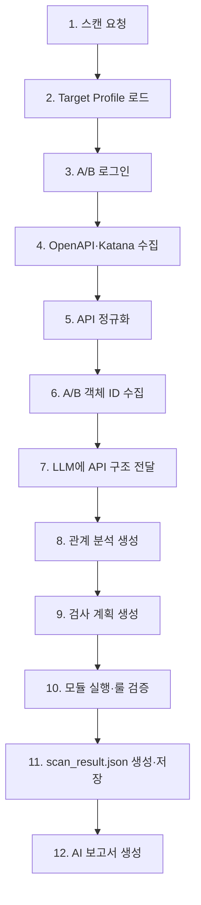

# 스캐너 명세서

## 1. 목적

`vuln-bank`의 API 구조를 수집·정규화하고, `user_a`·`user_b`의 독립 세션을 이용해 BOLA, 인증, 거래 검증, 민감정보 노출을 증거 기반으로 판정한다.

- 모듈 실행기와 검증기는 하나의 Executor 책임으로 통합한다.
- LLM은 API 관계 분석, 검사 계획 생성, 최종 보고서 작성만 수행한다.
- 취약점의 `verified` 확정은 LLM이 아니라 Executor 내부의 고정 룰이 수행한다.

## 2. 전체 흐름



| 단계 | 기능 | 산출물 |
| --- | --- | --- |
| 1 | 백엔드가 스캔 작업을 생성한다. | `scan_id` |
| 2 | 대상 URL, 범위, 로그인 설정, 안전 정책을 읽는다. | `target_profile.json` |
| 3 | `user_a`·`user_b`로 로그인해 토큰 또는 세션을 확보한다. | Runtime Session Context |
| 4 | OpenAPI를 우선 사용하고, A/B 인증 세션을 주입한 Katana로 누락 API 후보를 보완 수집한다. | OpenAPI·Katana 결과 |
| 5 | HTTP 메서드, 경로, 입력 구조, 응답 구조만 공통 형식으로 변환한다. | `normalized_api_graph.json` |
| 6 | 정규화된 API를 호출해 A/B의 계좌·거래·카드 등 검사에 필요한 객체 ID를 수집한다. | Runtime Object Context |
| 7 | API 구조와 사용 가능한 객체 유형만 LLM에 전달한다. 실제 토큰·객체 ID·응답값은 전달하지 않는다. | LLM 분석 입력 |
| 8 | LLM이 API 간 객체·데이터 흐름과 검사 후보를 분석한다. | `relationship_analysis.json` |
| 9 | LLM이 모듈, 대상 API, 입력 바인딩, 실행 순서를 제안한다. | `scan_plan.json` |
| 10 | Executor가 범위·요청 제한을 확인하고 기준·변형 요청을 실행한 뒤, 수집한 증거에 고정 룰을 적용한다. 원시 증거는 마스킹된 artifact로 보관한다. | 내부 evidence artifact |
| 11 | 확정된 finding의 판정 근거, 영향 필드, 마스킹된 증거 참조를 하나의 결과 계약으로 저장한다. | `scan_result.json` |
| 12 | 백엔드가 확정 finding만 LLM 보고서 모듈에 전달한다. | `ai_report.json` |

## 3. 스캐너 구조

```
scanner/
├─ crawler/
│  ├─ katana_runner.py      # 인증 세션을 주입한 Katana 보완 수집
│  └─ normalizer.py         # 수집 결과를 API 구조로 정규화
├─ auth/
│  └─ session_manager.py    # A/B 로그인, 토큰·객체 ID의 런타임 관리
├─ modules/
│  ├─ bola.py               # A 토큰 + B 객체 ID 검사
│  ├─ auth.py               # 토큰 제거·무효 토큰 검사
│  ├─ transaction.py        # 비정상 거래 입력과 상태 변화 검사
│  └─ data_exposure.py      # 응답 민감정보 검사
├─ executor.py              # 정책 확인, HTTP 실행, 증거 수집, 룰 검증, scan_result 생성
└─ scanner.py               # 전체 흐름 제어
```

`verifier.py`와 `execution_evidence.json`은 별도 구성요소로 두지 않는다. `executor.py`가 모듈 실행 직후 해당 모듈의 고정 룰을 적용하고, 최종 결과만 `scan_result.json`으로 만든다.

원시 요청·응답과 상태 비교 자료는 JSON 계약에 직접 넣지 않는다. 민감값을 마스킹한 evidence artifact에 보관하고, 확정 finding에서 `evidence_refs`로만 연결한다.

## 4. 모듈별 판정 기준

| 모듈 | 기준 요청 | 변형 요청 | `verified` 조건 |
| --- | --- | --- | --- |
| BOLA | A 토큰 + A 소유 객체 ID | A 토큰 + B 소유 객체 ID | B 소유 객체가 반환되거나 변경됨 |
| Auth | 유효 토큰 요청 | 토큰 없음 또는 무효 토큰 | 보호 자원 접근 또는 상태 변경이 성공함 |
| Transaction | 정상 입력 또는 정상 상태 조회 | 음수·0·한도 초과 등 비정상 거래 입력 | 비정상 입력 뒤 실제 잔액·거래 상태가 변경됨 |
| Data Exposure | 성공 응답 검사 | 없음 | 금지된 민감 필드·값이 마스킹 없이 반환됨 |

거래 모듈은 상태 변경이 필요한 검사다. 따라서 `target_profile.json`의 상태 변경 정책이 허용되고, 해당 HTTP 메서드가 능동 검사 범위에 포함된 경우에만 실행한다. 기본 안전 정책에서 상태 변경이 금지되어 있으면 이 모듈은 실행하지 않는다.

| 테스트 결과 | 처리 |
| --- | --- |
| `verified` | `scan_result.json.findings[]`에 추가 |
| `not_found` | finding으로 저장하지 않고 작업 상태·감사 로그에서 관리 |
| `inconclusive` | 증거 부족 또는 실행 불가 사유를 작업 상태·감사 로그에서 관리 |

따라서 `scan_result.json`의 빈 `findings` 배열은 **확정된 취약점이 없었다**는 뜻일 뿐, 모든 API가 안전하다는 의미는 아니다.

## 5. 공개 API

| API | 요청/응답 | 목적 |
| --- | --- | --- |
| `POST /api/scans` | `target_profile_id`, `requested_modules` → `scan_id` | 스캔 시작 |
| `GET /api/scans/{scan_id}` | 상태·진행률 | 스캔 상태 조회 |
| `GET /api/scans/{scan_id}/findings` | `scan_result.json` | 확정 finding 조회 |

프론트엔드는 계정 정보·비밀번호·토큰을 전송하지 않고 `target_profile_id`와 실행할 모듈만 보낸다. A/B 자격증명은 `target_profile.json`의 환경변수 참조를 통해 백엔드 또는 스캐너 런타임에서만 읽는다.

`execution_evidence.json`은 더 이상 JSON 계약에 포함하지 않는다. evidence artifact는 Executor가 내부 보관하며, 보고서 서비스가 권한을 가진 경우에만 `evidence_refs`를 통해 접근한다.

### `normalized_api_graph.json` 범위

이 파일은 API 구조만 담는다.

- 포함: `operation_id`, `method`, `path_template`, `inputs`, `outputs`
- 제외: API 간 `edges`, `confidence`, 인증 방식, 실제 요청·응답값, 토큰, 객체 ID, 수집 출처, 민감도 판단

API 간 관계와 검사 우선순위는 이후 `relationship_analysis.json`의 책임이다.

### `target_profile.json` 정책 해석

- `allowed_methods`는 **능동 검사 요청**에 적용한다.
- 인증 준비를 위한 `authentication.login` 요청은 별도 예외로 처리한다.
- 상태 변경 요청은 `state_change_policy`가 허용할 때만 수행한다.
- `approved_modules`의 식별자는 스캐너 모듈명과 일치시킨다: `bola`, `auth`, `transaction`, `data_exposure`.

## 6. 필수 원칙

- 실제 계정값·비밀번호·토큰·객체 ID·원시 응답값은 JSON 계약과 LLM 입력에 넣지 않는다.
- Executor는 모든 요청 전에 허용 도메인·경로·메서드·모듈·요청 횟수·초당 요청 수·상태 변경 정책을 확인한다.
- `scan_plan.json`은 제안일 뿐이며 Executor의 안전 정책을 우회할 수 없다.
- `scan_result.json`에는 `verified` finding만 넣고, 원시 증거는 마스킹된 artifact와 `evidence_refs`로 분리한다.
- LLM은 영향·설명·대응 방안을 작성할 수 있지만, finding의 확정·해제·재분류 권한은 갖지 않는다.